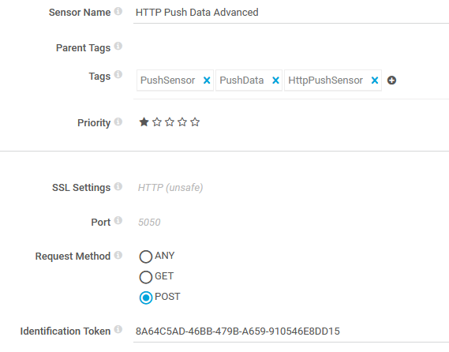
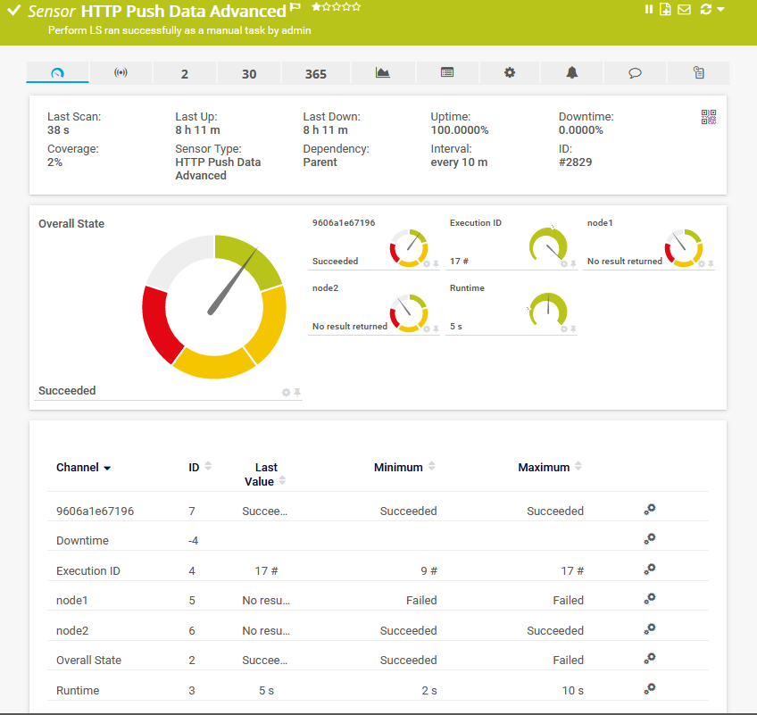

# Rundeck PRTG Notification Plugin

This is a simple groovy notification plugin for Rundeck to send the results to PRTG via the [HTTP Push Data Advanced Sensor](https://www.paessler.com/manuals/prtg/http_push_data_advanced_sensor)

## Usage

### Project / Framework Settings

The following project or framework level properties need to be set:

* `project.plugin.Notification.PrtgNotification.host` (required) - Hostname or IP address of PRTG Server
* `project.plugin.Notification.PrtgNotification.protocol` (optional) - HTTP or HTTPS. Defaults to HTTPS
* `project.plugin.Notification.PrtgNotification.port` (optional) - Port to use. Usually 5051 for HTTPS and 5050 for HTTP. Defaults to 5051

All three of those can be overridden at the Job Level if necessary.

### Job Settings

The following settings can be applied at the Job level

* `Token` (required) - The Identification Token for the PRTG Sensor
* `Level` (required) - The monitoring level. If `node` is specified, a channel for each node is added. If set to `job`, just the overall status is shown
* `hostOverride` (optional) - Overrides the host value set at the Project / Framework level
* `protocolOverride` (optional) - Overrides the protocol value set at the Project / Framework level
* `portOverride` (optional) - Overrides the port value set at the Project / Framework level

## Installation / Setup

This is not just a plug and play plugin. For PRTG, it requires setup for each job, in addition to a first time setup.

### Add Plugin to Rundeck

Just copy the `PrtgNotification.groovy` or compiled binary to `$RDECK_BASE/libext/`.

### PRTG: One Time Setup

1. Copy the `custom.prtg.rundecknotification.state.ovl` to `C:\Program Files (x86)\PRTG Network Monitor\lookups\custom` on your PRTG server(s) / probe(s).
2. Then, log into your PRTG server, and go to `Setup -> System Administration -> Administrative Tools` and run `Load Lookups and File Lists`

### PRTG: Per Job Setup

Then, for every Job, create a `HTTP Push Data Advanced Sensor`. The only thing you really need to ensure is that you use `POST` as the request method. Here is an example configuration:

## Example PRTG Output

Here is some sample output:

Notice how `node1` and `node2` have "No result returned" as their last value. This is so if you run the Job but only select a subset of nodes, it doesn't have an error.
